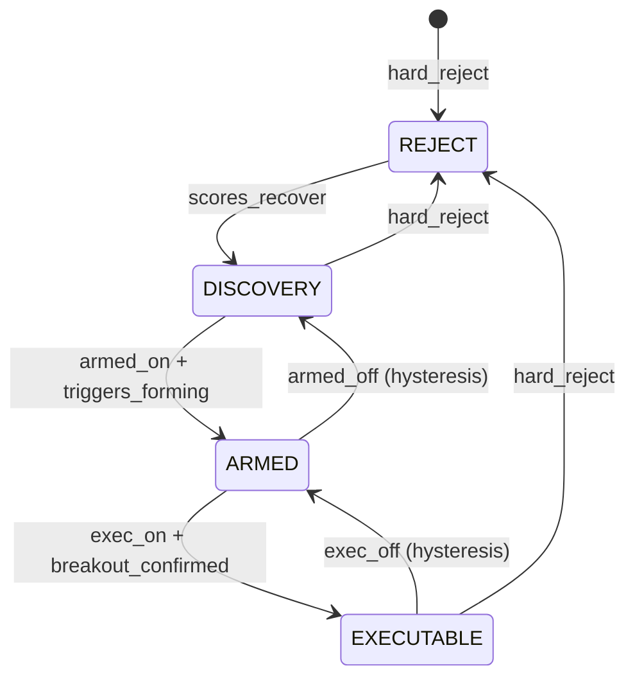

# Vajra Futures — Qualification & Presentation Architecture v2

**Status:** Design specification (pre-implementation)  
**Scope:** Trading-system architecture — not cosmetic UI  
**Goal:** Institutional-grade execution staging with strict false-positive control

---

## 1. Executive summary

The current pipeline is **technically correct** but **operationally misleading**:

| Symptom | Root cause |
|---------|------------|
| Top 8 all show WATCH | `select_top_picks()` back-fills with WATCHLIST when EXECUTABLE count = 0 |
| Users expect Top 8 = entries | Presentation couples **discovery rank** with **execution intent** |
| ENTER flickers (e.g. ITC ~5m) | Single threshold, no hysteresis, 5m bar-to-bar score noise |
| Rotational days feel “dead” | One global confidence ≥ 75 gate; phase caps downgrade without staging |
| TPS/EES strong but no ENTER | `confidence` (weighted trade_quality) ≠ `execution_score`; help text outdated |

**v2 redesign:** Split **discovery**, **arming**, and **execution** into explicit states with **separate score layers**, **phase-adaptive thresholds**, **hysteresis**, and **sectioned UI** (no fake Top 8 padding).

---

## 2. Current architecture (reference)

```
signal row (TPS/ECS/EES pipeline)
    → compute_trade_quality()     [trade_quality.py — single confidence + state]
    → apply_trade_state()         [trade_state.py — caps, rank, direction]
    → build_screener_display()    [ranking.py — Top 8 fill logic]
    → finalize_screener_row()     [ui_mapping.py — WATCH/ENTER mapping]
    → API / frontend
```

**Current states:** `WATCHLIST` | `EXECUTABLE` | `REJECT`  
**Current EXECUTABLE gate:** structure ≥ 62, momentum ≥ 58, extension ≥ 45, TPS ≥ 52, confidence ≥ 75  
**Current Top 8:** EXECUTABLE tier → then WATCHLIST until 8 rows (`market_phase_scoring.select_top_picks`)

---

## 3. Proposed architecture

### 3.1 Pipeline (v2)

```
signal row
    → compute_component_scores()      # structure, momentum, breakout, … (unchanged inputs)
    → compute_score_layers()          # NEW: discovery / execution / conviction / risk_efficiency
    → classify_raw_stage()            # NEW: DISCOVERY | ARMED | EXECUTABLE | REJECT (no hysteresis)
    → apply_phase_thresholds()        # NEW: dynamic gates by market_phase
    → apply_hysteresis()              # NEW: stable transitions vs prior persisted state
    → build_trade_state_dict()        # direction, tags, blockers, rank keys
    → build_screener_sections()       # NEW: sections, not padded Top 8
    → map_ui_actions()                # DISCOVERY=monitor, ARMED=prepare, EXECUTABLE=ENTER
    → API + frontend
```

### 3.2 State machine



**Allowed transitions (strict):**

- `REJECT` → `DISCOVERY` only when hard_reject clears
- `DISCOVERY` → `ARMED` when ARMED raw rules pass **and** (optional) discovery_score rising
- `ARMED` → `EXECUTABLE` when EXECUTABLE raw rules pass **and** breakout confirmation present
- Downgrades use **lower exit thresholds** (hysteresis), not symmetric gates

---

## 4. New trade states

| State | Trader meaning | Entry intent | UI action |
|-------|----------------|--------------|-----------|
| **DISCOVERY** | Institutional attention beginning; not near trigger | Monitor only | `MONITOR` (grey, passive) |
| **ARMED** | One trigger away; high-quality setup forming | Prepare / watch trigger | `ARMED` (amber, disabled or “Prepare”) |
| **EXECUTABLE** | Immediate trade-ready | Enter | `ENTER` (blue/green, enabled) |
| **REJECT** | Invalid / no edge | None | `—` |

**Backward-compat mapping (API v1 fields):**

| v2 state | Maps to legacy `qualification` | Maps to legacy `enter_action` |
|----------|-------------------------------|------------------------------|
| DISCOVERY | `WATCHLIST` (subtype=discovery) | `MONITOR` |
| ARMED | `WATCHLIST` (subtype=armed) | `ARMED` |
| EXECUTABLE | `EXECUTABLE` | `ENTER` |
| REJECT | `REJECT` | `""` |

Clients should prefer `qualification_state` + `qualification_stage` + `enter_action` v2 fields.

---

## 5. Split scoring system

**Do not** use one `confidence` score for discovery rank, execution gating, and UI tier.

### 5.1 Layer definitions

| Layer | Purpose | Primary inputs |
|-------|---------|----------------|
| `discovery_score` | Institutional attention / rotation | TPS, volume anomaly, phase (early expansion), participation, OBV, pipeline_stage |
| `execution_score` | Immediate tradability | breakout_score, VWAP reclaim, 5m validation, EES, execution_validated, extension control |
| `conviction_score` | Probability / continuation | structure, momentum, HTF, trend, phase-weighted trend strength |
| `risk_efficiency_score` | RR / chase risk | extension_quality, pullback_quality, distance to resistance, late impulse flags |

### 5.2 Modular scoring (pseudocode)

```python
@dataclass
class ScoreLayers:
    discovery_score: float          # 0–100
    execution_score: float          # 0–100
    conviction_score: float         # 0–100
    risk_efficiency_score: float    # 0–100
    # component passthrough
    structure_score: float
    momentum_score: float
    breakout_score: float
    extension_quality_score: float
    tps_score: float
    ees_score: float | None


def compute_score_layers(row: dict, tq: TradeQualityResult, phase: str) -> ScoreLayers:
    tps = f(row.get("tps_score"))
    ees = f(row.get("ees_score"))

    discovery = weighted_mean([
        (tps, 0.35),
        (tq.volume_score, 0.20),
        (phase_discovery_boost(phase), 0.15),
        (obv_participation_score(row), 0.15),
        (early_transition_boost(row), 0.15),
    ])

    execution = weighted_mean([
        (tq.breakout_score, 0.30),
        (vwap_reclaim_score(row), 0.25),
        (ees if ees else tq.execution_score, 0.25),
        (100 if row.get("execution_validated") else 40, 0.10),
        (tq.pullback_score, 0.10),
    ])

    conviction = weighted_mean([
        (tq.structure_score, 0.28),
        (tq.momentum_score, 0.28),
        (tq.htf_alignment_score, 0.22),
        (tq.trend_score, 0.22),
    ])

    risk_eff = weighted_mean([
        (tq.extension_quality_from_risk(), 0.50),
        (pullback_rr_score(row), 0.30),
        (100 - late_impulse_penalty(row), 0.20),
    ])

    return ScoreLayers(...)
```

**Legacy field policy:**

- Keep `confidence` / `trade_quality_score` as **deprecated aliases** of `conviction_score` for one release cycle.
- Document in API: `confidence` → `conviction_score`.

---

## 6. Qualification rules (raw classification)

Centralize in `backend/services/vajra/qualification_config.py` (new).

### 6.1 Hard reject (unchanged philosophy)

- structure < 38 OR momentum < 32 → REJECT  
- extension_quality < 28 → REJECT (over-extended)  
- compression chop (existing)  
- TPS < 52 with weak structure/momentum (existing low_tps path)

### 6.2 DISCOVERY

```python
def is_discovery_raw(layers, row, cfg) -> bool:
    if hard_reject(layers, row):
        return False
    return (
        f(row.tps_score) >= cfg.discovery.tps_min          # 45
        and layers.discovery_score >= cfg.discovery.score_min  # 50
        and (structure_improving(row) or momentum_improving(row))
    )
```

### 6.3 ARMED

```python
def is_armed_raw(layers, row, cfg, phase) -> bool:
    th = cfg.for_phase(phase).armed
    tags = derive_trigger_tags(row)  # waiting_breakout, needs_vwap_reclaim, ...
    return (
        layers.structure_score >= th.structure_min       # 58
        and layers.momentum_score >= th.momentum_min     # 55
        and layers.extension_quality_score >= th.extension_min  # 45
        and f(row.tps_score) >= th.tps_min               # 50
        and layers.execution_score >= th.execution_score_min  # 60
        and layers.conviction_score >= th.conviction_min      # 65
        and len(tags) > 0  # must know what's missing
    )
```

**Required tags (at least one):** `waiting_breakout`, `needs_vwap_reclaim`, `early_expansion`, `compression_ready`, `momentum_confirmation_pending`, `volume_expansion_pending`

### 6.4 EXECUTABLE

```python
def is_executable_raw(layers, row, cfg, phase) -> bool:
    th = cfg.for_phase(phase).executable
    return (
        layers.structure_score >= th.structure_min       # 62 default
        and layers.momentum_score >= th.momentum_min     # 58
        and layers.extension_quality_score >= th.extension_min
        and f(row.tps_score) >= th.tps_min               # 52
        and layers.execution_score >= th.execution_score_min  # 72
        and layers.conviction_score >= th.conviction_min     # phase-adaptive
        and breakout_confirmation_present(row)
    )
```

**`breakout_confirmation_present`:** breakout_score ≥ phase threshold AND (VWAP reclaimed OR execution_validated OR closed 5m above trigger level).

### 6.5 Raw stage precedence

```python
def classify_raw_stage(layers, row, cfg, phase) -> str:
    if hard_reject(...): return REJECT
    if is_executable_raw(...): return EXECUTABLE
    if is_armed_raw(...): return ARMED
    if is_discovery_raw(...): return DISCOVERY
    return REJECT  # or DISCOVERY if tps>0 — policy: weak → REJECT
```

---

## 7. Hysteresis (anti-flicker)

Persist per `(session_date, instrument_key)` in memory + optional DB column `qualification_state_prev`.

```python
@dataclass
class HysteresisBands:
    executable_enter_conviction: float = 75.0
    executable_exit_conviction: float = 68.0
    armed_enter_execution: float = 60.0
    armed_exit_execution: float = 52.0
    discovery_enter_discovery: float = 50.0
    discovery_exit_discovery: float = 42.0
    min_dwell_cycles: int = 1  # optional: require 2 consecutive 5m bars to upgrade


def apply_hysteresis(
    raw_stage: str,
    layers: ScoreLayers,
    prev: PriorState | None,
    cfg: QualificationConfig,
) -> str:
    prev_stage = prev.qualification_state if prev else None

    # Upgrade: must meet ENTER thresholds
    if raw_stage == EXECUTABLE and meets_executable_enter(layers, cfg):
        return EXECUTABLE

    # Hold EXECUTABLE until exit band breached
    if prev_stage == EXECUTABLE:
        if layers.conviction_score >= cfg.hysteresis.executable_exit_conviction \
           and layers.execution_score >= cfg.hysteresis.executable_exit_execution \
           and not hard_reject(...):
            return EXECUTABLE
        # else fall through to re-evaluate lower states

    if raw_stage == ARMED or prev_stage == ARMED:
        if prev_stage == ARMED and holds_armed(layers, cfg):
            return ARMED
        if meets_armed_enter(layers, cfg):
            return ARMED

    if raw_stage == DISCOVERY or prev_stage == DISCOVERY:
        if prev_stage == DISCOVERY and holds_discovery(layers, cfg):
            return DISCOVERY
        if meets_discovery_enter(layers, cfg):
            return DISCOVERY

    return REJECT
```

**Transition examples:**

| Cycle | conviction | execution | raw | prev | final |
|-------|------------|-----------|-----|------|-------|
| 1 | 76 | 74 | EXEC | — | EXEC |
| 2 | 72 | 70 | ARMED | EXEC | **EXEC** (hold: 72 ≥ 68 exit) |
| 3 | 67 | 65 | ARMED | EXEC | **ARMED** (exit EXEC) |
| 4 | 74 | 71 | EXEC | ARMED | **ARMED** (must re-enter at 75+, not 74) |

This prevents ITC-style 5m ENTER flashes unless scores **sustain** above exit bands.

---

## 8. Dynamic market-phase thresholds

New module: `qualification_config.py` — `PhaseThresholdProfile`

```python
PHASE_PROFILES = {
    "Trend Continuation": PhaseProfile(executable_conviction=75, armed_conviction=65, breakout_weight=1.0),
    "Rotational":         PhaseProfile(executable_conviction=68, armed_conviction=62, breakout_weight=0.85),
    "Compression":        PhaseProfile(executable_conviction=65, armed_conviction=60, breakout_weight=0.80),
    "Bull Expansion":     PhaseProfile(executable_conviction=78, armed_conviction=68, breakout_weight=1.1),
    "Bear Expansion":     PhaseProfile(executable_conviction=78, armed_conviction=68, breakout_weight=1.1),
    "Early Bull Expansion": PhaseProfile(executable_conviction=72, armed_conviction=63, ...),
    "Early Bear Expansion": PhaseProfile(executable_conviction=72, armed_conviction=63, ...),
}
```

**Design intent:**

- **Expansion:** stricter EXECUTABLE (avoid chasing late impulse) but lower ARMED bar to surface early names  
- **Rotational / Compression:** lower EXECUTABLE conviction (68/65) but **still require** breakout_confirmation + execution_score  
- Phase caps in `trade_state.apply_phase_qualification_cap` become **threshold shifts**, not blunt EXECUTABLE → WATCH demotions

---

## 9. Top 8 / screener presentation redesign

### 9.1 Replace padded Top 8

**New API shape** (`build_screener_display` v2):

```json
{
  "session_date": "2026-05-20",
  "market_regime_summary": "rotational_compression_dominant",
  "sections": {
    "EXECUTABLE": {
      "title": "Executable Now",
      "rows": [],
      "empty_message": null
    },
    "ARMED": {
      "title": "Armed — One Trigger Away",
      "rows": [ "... max 8 by armed_rank ..." ],
      "empty_message": null
    },
    "DISCOVERY": {
      "title": "Discovery — Institutional Attention",
      "rows": [ "... max 8 by discovery_rank ..." ],
      "empty_message": null
    }
  },
  "banner": {
    "type": "info",
    "message": "No executable setups currently. Market is rotational/compression-dominant."
  },
  "top_picks": [],
  "legacy_top_picks": []
}
```

**Rules:**

- **Never** pad EXECUTABLE section with ARMED/DISCOVERY rows  
- `top_picks` (legacy) = `sections.EXECUTABLE` only (may be empty)  
- ARMED/DISCOVERY capped separately (default max 8 each, configurable)  
- Banner shown when `len(EXECUTABLE) == 0` and session is open

### 9.2 Ranking keys (v2)

```python
def rank_executable(row) -> tuple:
    return (
        -row.execution_score,
        -row.conviction_score,
        -row.risk_efficiency_score,
        -liquidity_quality(row),
    )

def rank_armed(row) -> tuple:
    return (
        -trigger_proximity(row),      # distance to breakout/VWAP trigger
        -row.execution_score,
        -structure_tightness(row),
        -momentum_acceleration(row),
    )

def rank_discovery(row) -> tuple:
    return (
        -row.discovery_score,
        -participation_delta(row),
        -volume_anomaly(row),
    )
```

Remove `qual_bonus = 200 if EXECUTABLE else 80 if WATCHLIST` from rank — rank within tier using layer scores.

---

## 10. UI / UX mapping

### 10.1 Action column

| State | `enter_action` | `enter_enabled` | CSS class |
|-------|----------------|-----------------|-----------|
| DISCOVERY | `MONITOR` | false | `vajra-enter-btn-discovery` (grey) |
| ARMED | `ARMED` | false | `vajra-enter-btn-armed` (amber) |
| EXECUTABLE | `ENTER` | true | `vajra-enter-btn-enter` (blue) |
| REJECT | `—` | false | none |

### 10.2 Blocker display

New fields on row:

```json
{
  "qualification_state": "ARMED",
  "qualification_stage": "armed",
  "primary_blocker": "needs_vwap_reclaim",
  "blocker_label": "Waiting VWAP reclaim",
  "nearest_trigger": {
    "type": "vwap_reclaim",
    "distance_pct": 0.12,
    "label": "0.12% below VWAP"
  },
  "reason_tags": ["early_expansion", "needs_vwap_reclaim"]
}
```

### 10.3 Frontend sections (`vajra-futures-ratings.js`)

Replace single Top 8 table with:

1. **Executable Now** (only ENTER rows)  
2. **Armed** (amber section header)  
3. **Discovery** (grey section, collapsible)  
4. **Regime banner** when executable empty

Keep modal “more…” for full universe grouped by state.

---

## 11. Suggested class / module changes

### 11.1 New files

| File | Responsibility |
|------|----------------|
| `qualification_config.py` | `QualificationConfig`, `PhaseThresholdProfile`, `HysteresisBands` |
| `score_layers.py` | `ScoreLayers`, `compute_score_layers()` |
| `qualification_engine.py` | `classify_raw_stage`, `apply_hysteresis`, `derive_trigger_tags` |
| `screener_sections.py` | `build_screener_sections()`, regime banner |
| `state_persistence.py` | In-job cache + DB read/write prior state per session/symbol |

### 11.2 Refactored files

| File | Change |
|------|--------|
| `trade_quality.py` | Emit components only; remove `_classify_state` → delegate to `qualification_engine` |
| `trade_state.py` | `build_trade_state_dict` consumes v2 engine output; deprecate WATCHLIST constant usage |
| `market_phase_scoring.py` | Replace `select_top_picks` fill logic with `select_section_rows` |
| `ranking.py` | `build_screener_display` returns sections + banner |
| `actions.py` | Map DISCOVERY/ARMED/EXECUTABLE actions |
| `ui_mapping.py` | Normalize v2 states; legacy aliases |
| `job.py` | Persist `discovery_score`, `execution_score`, `conviction_score`, `qualification_state` |
| `tables.py` | Migration columns (see §13) |

### 11.3 Core dataclass

```python
@dataclass
class TradeQualificationResult:
    qualification_state: str       # DISCOVERY | ARMED | EXECUTABLE | REJECT
    score_layers: ScoreLayers
    reason_tags: list[str]
    primary_blocker: str | None
    nearest_trigger: dict | None
    reject_reasons: list[str]
    raw_stage: str                 # pre-hysteresis (debug)
    hysteresis_applied: bool
```

---

## 12. Sample JSON payload (API row)

```json
{
  "stock": "LTM",
  "session_date": "2026-05-20",
  "qualification_state": "ARMED",
  "qualification_stage": "armed",
  "qualification": "ARMED",
  "discovery_score": 71.2,
  "execution_score": 64.5,
  "conviction_score": 70.3,
  "risk_efficiency_score": 82.1,
  "confidence": 70.3,
  "structure_score": 69.8,
  "momentum_score": 80.0,
  "breakout_score": 62.0,
  "tps_score": 74.1,
  "ees_score": 40.0,
  "market_context": "Early Bull Expansion",
  "execution_bias": "LONG",
  "enter_action": "ARMED",
  "enter_enabled": false,
  "enter_reason": "Armed — awaiting breakout close (conviction 70/72 required for EXEC)",
  "primary_blocker": "waiting_breakout",
  "blocker_label": "Awaiting breakout close",
  "reason_tags": ["early_expansion", "waiting_breakout"],
  "nearest_trigger": {
    "type": "breakout_close",
    "distance_pct": 0.08,
    "label": "0.08% below trigger"
  },
  "raw_stage": "ARMED",
  "hysteresis_applied": true
}
```

---

## 13. Migration-safe implementation plan

### Phase 1 — Foundation (no UI break)

1. Add `qualification_config.py`, `score_layers.py`, `qualification_engine.py`  
2. Unit tests: raw classification + hysteresis transitions (table-driven)  
3. Run v2 engine **in parallel** inside job; log diff vs v1 (`v1_state`, `v2_state`)  
4. DB migration: add nullable columns  
   - `discovery_score`, `execution_score_v2`, `conviction_score`, `risk_efficiency_score`  
   - `qualification_state_v2`, `primary_blocker`, `blocker_tags` (jsonb)

### Phase 2 — API v2 (backward compatible)

1. Add query param `qualification_version=2` on `/api/vajra-futures/ratings`  
2. Default remains v1 for one release  
3. Response adds `sections`, `banner`; `top_picks` = executable only when v2  
4. Map v2 → legacy fields for old clients

### Phase 3 — Frontend

1. Sectioned UI behind feature flag `?screener=v2` or settings toggle  
2. Update help guide (remove TPS+EES-only ENTER claim)  
3. CSS: discovery / armed / enter styles

### Phase 4 — Cutover

1. Default API to v2  
2. Remove WATCHLIST back-fill in `select_top_picks`  
3. Deprecate single-threshold `EXECUTABLE_CONFIDENCE_MIN` in `trade_quality.py`

### Phase 5 — Hysteresis persistence

1. Store prior state in `vajra_futures_rating` or lightweight `vajra_qualification_state` table  
2. Job reads prior on each 5m tick

---

## 14. Backward compatibility

| Consumer | Strategy |
|----------|----------|
| Old frontend | `qualification` maps ARMED/DISCOVERY → `WATCHLIST`; `enter_action` WATCH/MONITOR |
| Telegram ENTER alerts | Fire only on `EXECUTABLE` **upgrade** after hysteresis dwell |
| DB readers | `entry_state` column writes v2 state string; migration script maps WATCHLIST → ARMED if execution_score ≥ 60 |
| Tests | Keep `test_vajra_screener.py`; add `test_vajra_qualification_v2.py` |

---

## 15. Edge cases

| Case | Handling |
|------|----------|
| First bar of session (no prior state) | Hysteresis uses enter thresholds only; no hold |
| Market closed / stale candles | Skip hysteresis upgrade; allow downgrade to DISCOVERY |
| Phase changes mid-session | Re-evaluate with new phase profile; hold EXECUTABLE if exit bands still met |
| EXECUTABLE=0, ARMED=0, DISCOVERY=3 | Show banner + discovery section only; no fake Top 8 |
| Symbol flips LONG→SHORT | Reset hysteresis prior for that symbol |
| Compression + high TPS | DISCOVERY or ARMED with `compression_ready` tag; not EXECUTABLE without breakout |
| `execution_validated` false but scores high | ARMED max; EXECUTABLE requires confirmation flag or breakout |
| DB read without component scores | Recompute layers live in `finalize_screener_row` (existing pattern) |

---

## 16. Testing strategy

1. **Golden fixtures:** CSV of (inputs → expected v2 state) from May 20 session (LTM, ITC, NHPC)  
2. **Hysteresis sequences:** simulate 5m score paths; assert no single-bar EXECUTABLE  
3. **Phase matrix:** same scores under Rotational vs Expansion profiles  
4. **Regression:** v1 EXECUTABLE ⊆ v2 EXECUTABLE or document intentional expansions  
5. **UI contract:** snapshot tests for empty executable banner

---

## 17. Configuration structure (centralized)

```python
# qualification_config.py

@dataclass(frozen=True)
class TierThresholds:
    structure_min: float
    momentum_min: float
    extension_min: float
    tps_min: float
    execution_score_min: float
    conviction_min: float

@dataclass(frozen=True)
class QualificationConfig:
    discovery: TierThresholds
    armed: TierThresholds
    executable: TierThresholds
    hysteresis: HysteresisBands
    phase_profiles: dict[str, PhaseThresholdProfile]
    section_limits: dict[str, int]  # EXECUTABLE: 8, ARMED: 8, DISCOVERY: 8

DEFAULT_CONFIG = QualificationConfig(...)

def for_phase(self, phase: str) -> PhaseThresholdProfile:
    return self.phase_profiles.get(phase, self.phase_profiles["Rotational"])
```

Environment override: `VAJRA_QUAL_CONFIG_PATH` for JSON tuning without code deploy (optional Phase 2+).

---

## 18. Design philosophy checklist

| Must | Must not |
|------|----------|
| Preserve strict EXECUTABLE quality | Blindly lower all thresholds |
| Surface early institutional setups (DISCOVERY/ARMED) | Pad Top 8 with non-executable rows |
| Stabilize ENTER with hysteresis | Promote weak setups to ENTER for activity |
| Phase-adaptive thresholds | Overfit one session’s ITC flash |
| Clear blocker labels | Generic WATCH for all non-ENTER |

---

## 19. Implementation priority (recommended)

1. **Config + score layers + raw classifier** (highest leverage)  
2. **Hysteresis + persistence** (fixes flicker)  
3. **Sectioned screener API + banner** (fixes Top 8 confusion)  
4. **Phase profiles** (fixes rotational day starvation)  
5. **Frontend sections + ARMED/MONITOR styling**  
6. **Parallel v1/v2 logging → cutover**

---

## 20. References (current code)

- `backend/services/vajra/trade_quality.py` — `_classify_state`, `EXECUTABLE_CONFIDENCE_MIN = 75`  
- `backend/services/vajra/trade_state.py` — `apply_phase_qualification_cap`, `compute_execution_rank_score`  
- `backend/services/vajra/market_phase_scoring.py` — `select_top_picks` WATCHLIST back-fill (lines 96–100)  
- `backend/services/vajra/ranking.py` — `build_screener_display`  
- `backend/services/vajra/actions.py` — ENTER/WATCH binary  
- `frontend/public/vajra-futures-ratings.js` — Top 8 render, `QUAL_WATCHLIST` / `QUAL_EXECUTABLE`

---

*End of specification.*
