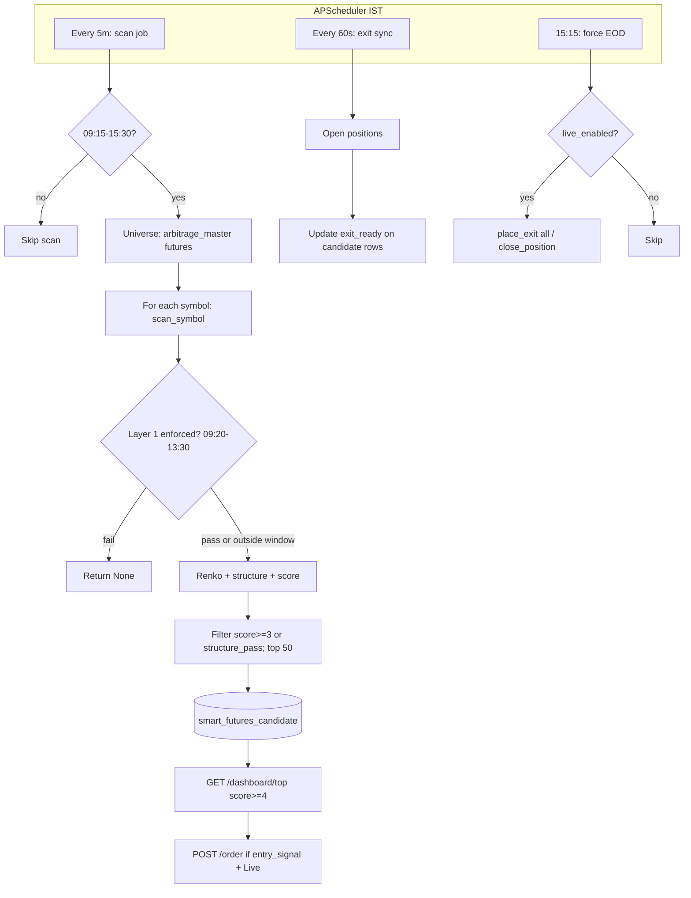

# Smart Futures — execution sequence guide

IST throughout. Code lives under `backend/services/smart_futures/` and `backend/services/smart_futures_scheduler.py`. API routes: `/api/smart-futures/*` and `/smart-futures/*`.

---

## 1. Startup (backend)

1. FastAPI lifespan starts **`start_smart_futures_scheduler()`** (`backend/main.py`).
2. **APScheduler** registers three jobs (`smart_futures_scheduler.py`):
   | Job | Trigger | Purpose |
   |-----|---------|---------|
   | `sf_scan` | Every **5 minutes** | Full universe scan → DB candidates |
   | `sf_exit` | Every **60 seconds** | Sync `exit_ready` on candidates for open positions |
   | `sf_force_eod` | **15:15 IST** daily | Force-square-off all open Smart Futures positions (if Live) |

   Job defaults: `max_instances: 1`, `coalesce: true`, `misfire_grace_time: 300` (one long scan at a time).

---

## 2. Session date (DB bucket)

**`effective_session_date_ist()`** (`session_calendar.py`):

- **Before 08:50 IST** on a calendar day → session key = **previous** calendar day.
- **From 08:50 IST** onward → session key = **today**.

Candidates and positions are keyed by this `session_date`.

---

## 3. Scan job — `run_smart_futures_scan_job(force=False)`

### 3.1 When it runs

- **Window check** (`pipeline.py`): unless `force=True`, the job **returns immediately** if current time is **outside 09:15–15:30 IST** (logged as `outside_window`).
- Inside the window (or `force=True`): proceeds.

### 3.2 Universe

1. **`fetch_future_symbols()`** — rows from `arbitrage_master` with non-null `currmth_future_instrument_key`.
2. Cap: **`SMART_FUTURES_MAX_SYMBOLS`** (default **250**, `data_service._max_symbols()`).
3. **`get_config()`** — `smart_futures_config` (brick ATR period, override, live flags, etc.).

### 3.3 Per symbol — `scan_symbol(...)`

Executed **sequentially** for each future (Upstox calls per symbol; full pass can take many minutes).

**Data**

- Resolve **main brick size**: admin `brick_atr_override`, else **ATR(`brick_atr_period`) on 1h** candles.
- Load **5m** (6 days) and **15m** (10 days) candles; require enough 5m bars.
- **Previous close**: daily candles, else OHLC fallback.

**Layer 1 — gap / volume / ATR move** (`prefilter_gap_volume_atr` in `data_service.py`)

- Gap: `|open − prev_close| / prev_close ≥ 0.7%`.
- First ~15m volume vs average of prior sessions’ first ~15m (via 5m proxy).
- Intraday move vs open: `|last_close − session_open| ≥ 0.5 × ATR(14) on 15m`.

**Enforcement window** (`scanner.py`): Layer 1 **drops** the symbol (`return None`) only when **09:20–13:30 IST**. Outside that window, Layer 1 is **not** used to exclude names; Renko still runs and `prefilter_pass` is stored as `True` for display when outside the window.

**Layer 2 — Renko**

- Build **traditional Renko** from 5m closes and `main_brick_size`.
- **Structure**: `renko_structure_filter_long` / `_short`; resolve **LONG / SHORT / NONE** and `structure_pass`.
- **Score 0–6** (`compute_score`): last bricks alignment (+2), low alternation (+2), **momentum** (+1), **volume spike** (+1), capped at 6.
- **Momentum flag**: 5m move vs **ATR(14) on 15m** (threshold in scanner).
- **Vol spike**: first-15m volume vs `vol_prev_avg` from meta.

**Layer 3 — entry signal (UI / order eligibility)**

- Only **09:45–11:30 IST**.
- Requires `structure_pass`, direction LONG/SHORT, **`score ≥ 4`**, plus **pullback** (`entry_pullback_long` / `_short` on bricks).
- Sets `entry_signal` true/false.

### 3.4 Persist

1. Keep rows where **`score ≥ 3` OR `structure_pass`**.
2. Sort by score desc, take **top 50**.
3. **`replace_candidates_session(session_date, rows)`** — replaces all rows for that `session_date` in **`smart_futures_candidate`**.

Log line: `smart_futures scan stored N candidates for YYYY-MM-DD`.

---

## 4. Exit sync job — `run_smart_futures_exit_check_job()`

Every **60s**:

1. Load **open** `smart_futures_position` rows for today’s `session_date`.
2. For each position, **`should_exit_position(instrument_key, direction, main_brick_size)`** (1m Renko exit logic in `signal_engine.py`).
3. **`UPDATE smart_futures_candidate`** set **`exit_ready`** for matching `instrument_key` / `session_date`.

Does **not** place orders by itself; it only updates flags for the UI.

---

## 5. Force EOD — `force_exit_all_smart_futures_positions()`

**15:15 IST** cron:

- If **`live_enabled`** is false → skip.
- Else for each open position: **`place_exit`** (market, MIS), audit, **`close_position`**.

---

## 6. API & UI sequence (authenticated user)

Typical dashboard load order (`smart_futures.py` + `frontend/public/smartfuture.js`):

1. **`GET /dashboard/top`** — up to **3** candidates from DB with **`score ≥ 4`** (`SMART_FUTURES_MIN_SCORE`), sorted by score.
2. **`GET /config`** — live flag, position size, brick settings.
3. **`GET /dashboard/positions`** — open positions + `exit_ready`.
4. **`GET /dashboard/live-quotes`** — batch LTP for top candidates’ keys.

**Entry** — `POST /order` (requires **Live = Yes**):

- Resolves candidate matching `instrument_key`, direction, and **`entry_signal`** true among **`score ≥ 4`** pool.
- **`place_entry`** → **`insert_position`** → **`insert_order_audit`**.

**Exit** — `POST /exit`:

- Validates **`should_exit_position`** for that position; supports partial exit if configured.

---

## 7. End-to-end flow (diagram)

---

## 8. Logs & env

- Scheduler / pipeline: **`logs/trademanthan.log`** (e.g. `smart_futures scan begin`, `progress`, `stored`).
- Optional: **`SMART_FUTURES_MAX_SYMBOLS`** — cap universe size.

---

## 9. What does *not* run automatically

- **No auto-entry** from scan: `auto_execute_entry_signals()` is a stub (`skipped`).
- User must have **Live** on and use the UI **Order** action when **`entry_signal`** is true and row is in the **`score ≥ 4`** candidate set.
